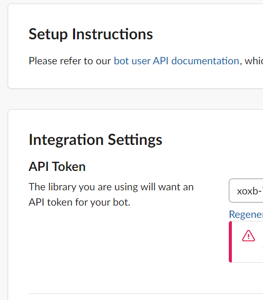
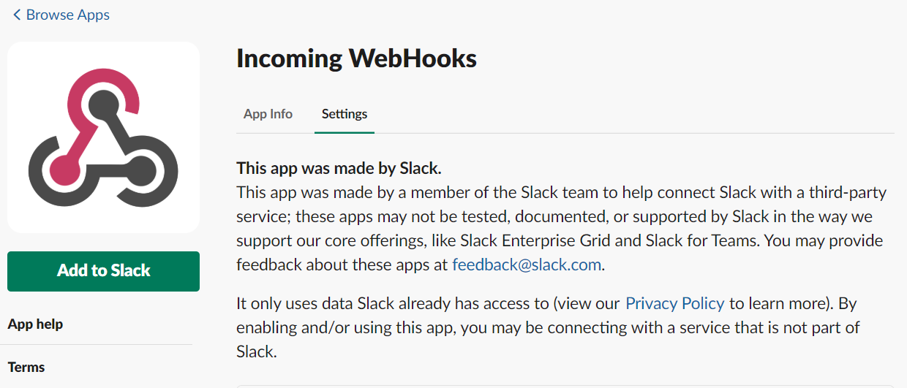
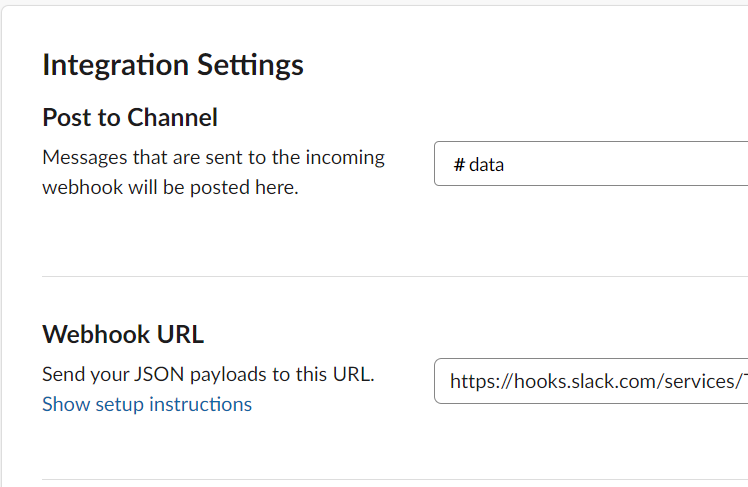

# Web_Crawling

- [Web_Crawling](#webcrawling)
  - [Need Install](#need-install)
    - [Package](#package)
    - [Application](#application)
  - [Project](#project)

***

## Need Install

### Package

- numpy
- pandas
- time
- requests
- os
- slackclient
- json
- selenium
- scrapy
- pymongo

### Application

- Slack

  1. add bots application

     

     and add API token

     

  2. add WebHook

     

     and add WebHook url

     

- Chromedriver

  1. install Chromedriver

  2. move to /usr/local/bin

```CMD
$sudo cp chromedriver /usr/local/bin
```

***

## Project

- Web_Crawling

  - Weather
    - selenium

  - News
    - scrapy

  - Dictionary
    - selenium

- Send_msg
  - send my slack
    - send img
    - send msg

- Save_Mongodb

***
